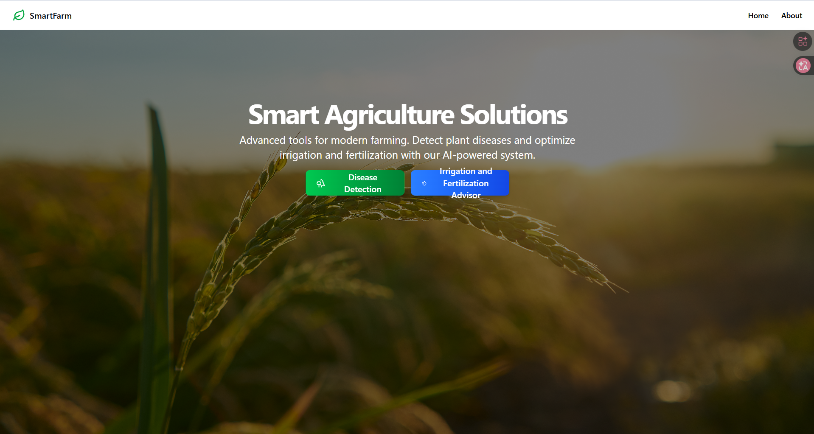
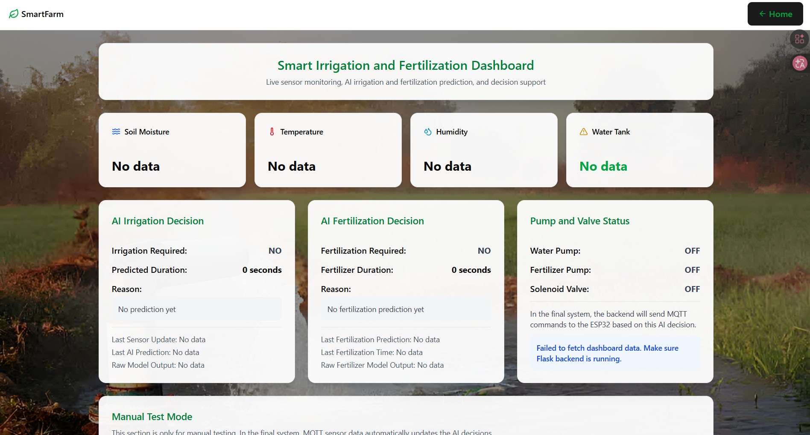
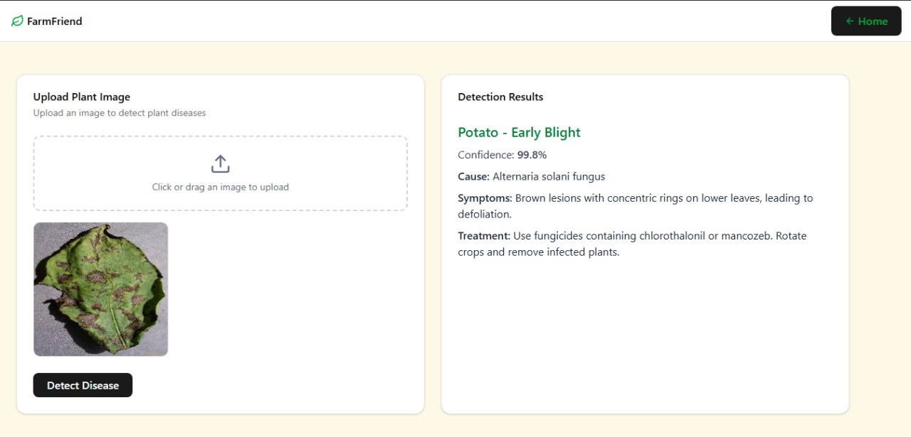
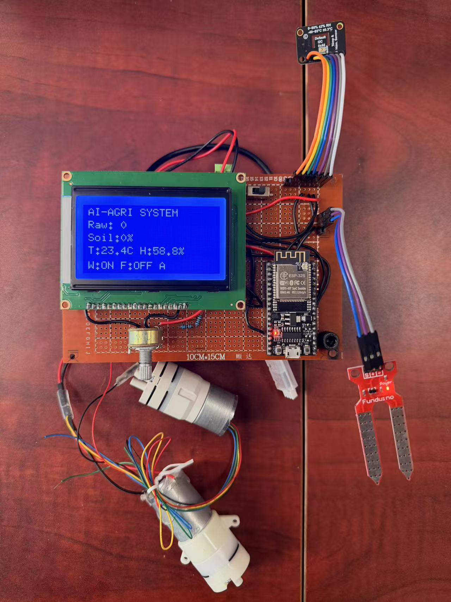

# SmartFarm: A Smart Agriculture System

SmartFarm is an intelligent agriculture solution designed to support modern farming through **plant disease detection**, **AI-based irrigation prediction**, and **AI-based fertilization decision support**. The system combines a user-friendly web interface with a Flask backend, machine learning models, MQTT communication, and ESP32-based sensor hardware.

The project provides farmers with real-time monitoring, automated decision support, and actionable insights for better crop care, water usage, and fertilization management.

## Project Status

This project is currently designed to run locally with the Flask backend, MQTT broker, ESP32 hardware, and React frontend.

## Key Features

  * **Plant Disease Detection:** Users can upload a plant leaf image, and the system predicts the disease class along with confidence, cause, symptoms, and treatment recommendation.

  * **AI-Based Irrigation Decision:** The system analyzes soil moisture, temperature, humidity, and water tank status to predict whether irrigation is required.

  * **AI-Based Fertilization Decision:** The system predicts whether fertilization is required using environmental conditions and fertilization-related timing features.

  * **IoT Sensor Integration:** ESP32 collects real-time sensor data such as soil moisture, temperature, humidity, and water level.

  * **MQTT-Based Communication:** Sensor data is published from ESP32 to the backend using MQTT, and AI-generated commands are sent back to the ESP32.

  * **Automated Actuation:** The backend can send control commands for the water pump, fertilizer pump, and solenoid valve.

  * **User-Friendly Dashboard:** A clean React and Vite web dashboard displays live sensor values, AI decisions, pump status, valve status, and system updates.

  * **Scalable Backend:** The Flask backend manages API requests, machine learning predictions, MQTT communication, and actuator command generation.

-----

## System Architecture & Technology Stack

The system follows an IoT + AI architecture. The ESP32 hardware node collects sensor readings and publishes them to the MQTT topic `agri/sensors`. The Flask backend subscribes to this topic, receives the live sensor data, runs the irrigation and fertilization AI models, and publishes actuator commands to the MQTT topic `agri/commands`. The React frontend displays live dashboard information and provides a plant disease detection interface.

  * **Frontend:** React, Vite, TypeScript
  * **Backend:** Python, Flask
  * **Communication:** MQTT, Mosquitto Broker
  * **IoT Hardware:** ESP32, soil moisture sensor, temperature/humidity sensor, water level sensor, relay module, water pump, fertilizer pump, solenoid valve
  * **Machine Learning:** Scikit-learn, Joblib, NumPy, Pandas
  * **Deep Learning:** TensorFlow, Keras
  * **Primary Dataset Sources:** Kaggle / PlantVillage and tabular irrigation/fertilization datasets

-----

## System Workflow

The overall workflow of SmartFarm is:

  * ESP32 reads sensor values from the field.
  * ESP32 publishes sensor data to the MQTT topic `agri/sensors`.
  * Flask backend receives the live sensor data.
  * AI models predict irrigation and fertilization requirements.
  * Backend applies safety and decision logic.
  * Backend publishes control commands to `agri/commands`.
  * ESP32 receives the command and controls the pump, solenoid valve, or fertilizer pump.
  * Web dashboard displays the latest sensor values, AI decisions, and actuator status.

For plant disease detection:

  * User uploads a plant image on the website.
  * Flask backend processes the image.
  * Deep learning model predicts the disease class.
  * The system displays confidence, cause, symptoms, and treatment recommendation.

-----

## MQTT Communication

The project uses MQTT for lightweight real-time communication between the ESP32 and Flask backend.

| Topic | Direction | Purpose |
|---|---|---|
| `agri/sensors` | ESP32 → Backend | Sends live sensor readings |
| `agri/commands` | Backend → ESP32 | Sends pump, valve, and fertilizer commands |

Example sensor data:

```json
{
  "soil_percent": 35,
  "temperature": 24.5,
  "humidity": 62.0,
  "water_low": false,
  "pump_water": false,
  "solenoid": false,
  "pump_fert": false
}
```

Example backend command:

```json
{
  "water_pump": true,
  "solenoid": true,
  "duration_sec": 15,
  "fert_pump": false,
  "fert_duration_sec": 0,
  "source": "ai_models",
  "irrigation_reason": "AI predicts irrigation is required because soil moisture is very low.",
  "fertilizer_reason": "AI predicts fertilization is not required under current conditions."
}
```

-----

## Core Models

### 1. Plant Disease Detection

This module uses a deep learning model to classify plant diseases from uploaded leaf images.

  * **Model:** MobileNetV2 with Transfer Learning.
  * **Task:** Image classification.
  * **Input:** Plant leaf image.
  * **Output:** Disease name, confidence score, cause, symptoms, and treatment recommendation.
  * **Why MobileNetV2?** It provides a good balance between accuracy and computational efficiency, making it suitable for lightweight smart agriculture applications.
  * **Training:** The model is trained using plant disease image datasets such as PlantVillage.

### 2. AI-Based Irrigation Prediction

This module predicts whether irrigation is required based on soil and environmental conditions.

  * **Model:** Machine learning classification model.
  * **Task:** Irrigation requirement prediction.
  * **Input Features:** Soil moisture, temperature, humidity, water tank status, and other environmental values depending on the model configuration.
  * **Output:** `Irrigation Required` or `Irrigation Not Required`.
  * **Additional Output:** Suggested watering duration and explanation/reason.
  * **Purpose:** Helps reduce water waste and supports better crop care.

### 3. AI-Based Fertilization Decision

This module predicts whether fertilization is required.

  * **Model:** Machine learning classification model.
  * **Task:** Fertilization requirement prediction.
  * **Input Features:** Temperature, humidity, soil moisture, days since last fertilization, days since last watering, watering count, and plant age.
  * **Output:** `Fertilization Required` or `Fertilization Not Required`.
  * **Additional Output:** Fertilizer duration and explanation/reason.
  * **Note:** This is a prototype fertilization model. Future versions can be improved using NPK, pH, and EC sensors for more accurate nutrient-based fertilization.

-----

## Dashboard Features

The SmartFarm dashboard provides a real-time overview of the system status.

  * Soil moisture monitoring
  * Temperature monitoring
  * Humidity monitoring
  * Water tank status
  * AI irrigation decision
  * AI fertilization decision
  * Water pump status
  * Fertilizer pump status
  * Solenoid valve status
  * Last sensor update time
  * Last AI prediction time
  * Manual test mode for checking predictions before final hardware validation

-----

## Model Alternatives Explored

To improve the system design and model selection, several alternatives were considered:

  * **ResNet50:** Provides high accuracy for disease detection but is heavier than MobileNetV2.
  * **VGG16:** Suitable for image classification but less efficient for lightweight deployment.
  * **Random Forest:** Useful for tabular prediction and feature importance but may be heavier than simpler models.
  * **Logistic Regression:** Fast, interpretable, and suitable for real-time tabular decision-making.
  * **SVM & Naive Bayes:** Lightweight alternatives, but performance depends heavily on dataset quality and feature distribution.

-----

## Project Demo

Here is a glimpse of the SmartFarm user interface and dashboard.

### Home Page



### Irrigation and Fertilization Dashboard



### Plant Disease Detection



-----

## How to Run the Project

### 1. Start MQTT Broker

From the project root folder:

```powershell
mosquitto -v -c .\mqtt_test.conf
```

Example `mqtt_test.conf`:

```text
listener 1883 0.0.0.0
allow_anonymous true
log_type all
```

### 2. Run Flask Backend

```powershell
cd smart_agriculture_api
.\xia\Scripts\activate
python app.py
```

Backend runs on:

```text
http://127.0.0.1:5000
```

### 3. Run Frontend

```powershell
cd smart-agriculture-frontend
npm install
npm run dev
```

Frontend runs on:

```text
http://localhost:5173
```

### 4. ESP32 Hardware Flow

  * ESP32 connects to Wi-Fi.
  * ESP32 connects to the MQTT broker.
  * ESP32 publishes sensor data to `agri/sensors`.
  * Flask backend receives sensor data and runs AI predictions.
  * Backend publishes commands to `agri/commands`.
  * ESP32 receives commands and controls the actuators.

-----
-----

## Hardware Prototype

The SmartFarm prototype integrates ESP32-based IoT hardware with AI-driven decision making. The hardware setup includes:

  * ESP32 microcontroller
  * Soil moisture sensor
  * Temperature and humidity sensor
  * LCD monitoring display
  * Water pump
  * Fertilizer pump
  * MQTT communication support

The ESP32 receives sensor data, sends it to the Flask backend through MQTT, and receives AI-generated irrigation and fertilization commands in real time.



-----
## Future Scope

We plan to enhance SmartFarm with the following improvements:

  * **Improved Sensor Integration:** Add more sensors such as NPK, pH, and EC sensors for better soil and nutrient analysis.
  * **Advanced Fertilization Model:** Improve fertilization prediction using real nutrient-level data.
  * **Historical Analytics Dashboard:** Store sensor readings and decisions for trend analysis.
  * **Farmer Alerts:** Add notification support for irrigation, fertilization, water tank, and disease alerts.
  * **Cloud Deployment:** Deploy backend services to a cloud platform for remote access and scalability.
  * **Mobile Application:** Develop a mobile app for farmers to monitor the system anywhere.
  * **Large-Scale Field Testing:** Extend the system for larger farm environments and multiple sensor nodes.

-----

## Contributors

  * **Muhammad Musab** - [@Musabnouman](https://github.com/Musabnouman)
  * **Muhammad Haris Khan** - [@harrisbuddy15](https://github.com/harrisbuddy15)
  * **AbdulkareemAhed** - [@AbdulkareemAhed(https://github.com/AbdulkareemAhed)

